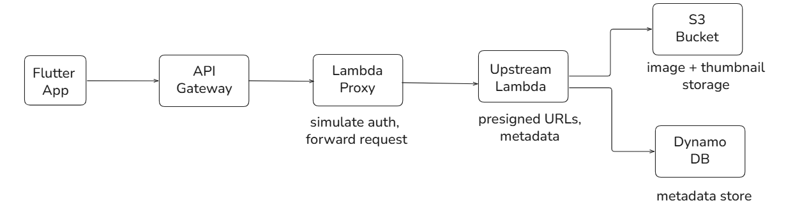
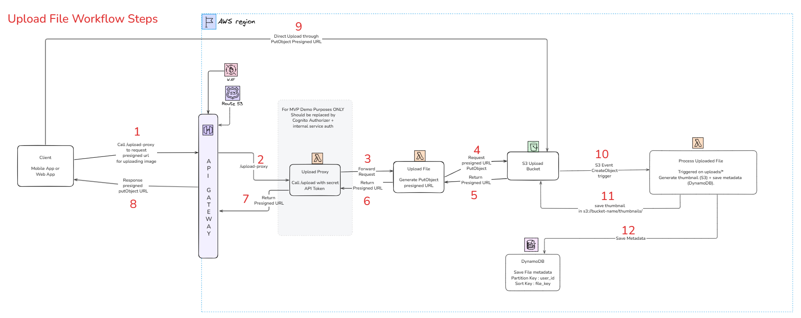
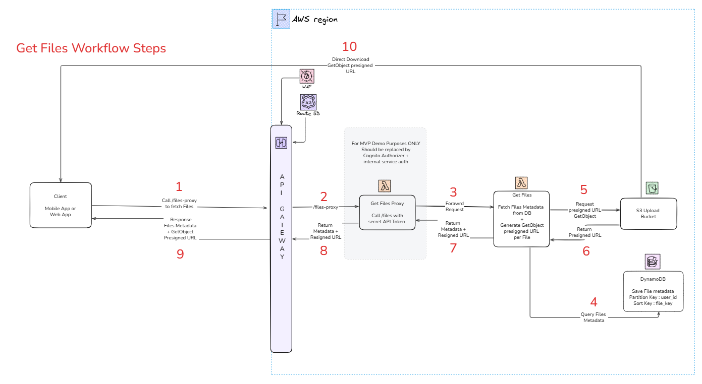

# Mini Gallery App Infrastructure – Terraform on AWS

**🟢 Pipeline Status**


Infrastructure-as-Code (IaC) for the [**Mini Gallery App**](https://github.com/lrasata/mini_gallery_app) backend on AWS
using Terraform.

This project provisions a **serverless image upload and metadata system**:

- API Gateway + Lambda + S3 + DynamoDB
- Monitoring dashboards & alerts
- Image moderation & quarantine workflows

It is designed to be deployed **via GitHub Actions using AWS OIDC** (no long-lived AWS keys required).

## Overview

The architecture demonstrates a complete **upload and retrieval workflow**:

- Secure image upload via **presigned URLs**
- Metadata stored in **DynamoDB**
- Thumbnail generation
- Content moderation using **Rekognition**
- Fully automated **infrastructure deployment with Terraform**

> 🚧 **Demo Notes:**  
> A lightweight Lambda **proxy** layer simulates a backend authorizer.
> - Prevents exposing API secrets to the frontend
> - In production, replace with **Cognito Authorizer** on API Gateway

## High-Level Architecture



- Proxy Lambda handles requests, injects backend secrets, forwards to processing Lambda
- **Presigned URLs** keep S3 private, avoiding exposure of AWS credentials on clients

## Features

- Upload images using presigned URLs
- Fetch uploaded images with metadata
- Thumbnail generation
- Content moderation with Rekognition
- Infrastructure deployment via Terraform

## Components Deployed

### File Uploader Backend

Imports the [file uploader module](https://github.com/lrasata/infra-file-uploader):

- S3 buckets (+ access logs)
- DynamoDB table for file metadata
- Lambda functions (upload processing, listing files)
- API Gateway (custom domain + certificate)
- WAF protection
- Route53 DNS records
- SNS topics & alerts
- KMS keys / aliases
- CloudWatch dashboards & alarms

### Image Moderation

Imports the [content moderator module](https://github.com/lrasata/infra-s3-image-moderator):

- Lambda functions for scanning & moderation
- Quarantine S3 bucket & access logs
- EventBridge scheduled rules
- SNS alerts
- KMS keys / aliases

## How It Works

### Upload Flow

1. Flutter requests presigned PUT URL from backend
2. Backend Lambda generates presigned URL
3. Flutter uploads directly to S3



### Fetch Images

1. Flutter requests image list from backend
2. Backend queries DynamoDB
3. Backend returns presigned GET URLs for each object



## Architectural Choices

- **Serverless Stack**: AWS Lambda + API Gateway + S3 + DynamoDB provides a fully managed, scalable backend without the
  overhead of provisioning servers.
- **Presigned URLs**: Chosen for secure direct-to-S3 uploads/downloads, minimizing backend load and avoiding exposing
  AWS credentials.
- **Proxy Lambda**: Demonstrates internal request forwarding and secret management; in production this would be replaced
  by Cognito Authorizer for authentication.
- **Content Moderation**: AWS Rekognition allows automated detection of inappropriate content without maintaining custom
  ML models.

## Security Considerations

- Frontend never stores AWS credentials or secrets.
- **Presigned URLs** are used for uploads and downloads, granting temporary, time-limited access to specific objects without exposing AWS credentials.
- **API Protection**: Proxy Lambda hides secrets. Proxy Lambda forwards requests from Frontend to call protected endpoints by injecting API Token to the request; in production, use **Cognito Authorizer with JWTs**
- **Encryption**: S3 buckets and SNS topics are encrypted using KMS keys.

## Scalability

- All components are serverless and automatically scale with demand; Lambda concurrency and S3/DynamoDB
  throughput handle variable loads.

## Future enhancements

- Integrate **Cognito authentication**
- Add **pagination & caching**
- Add automated **unit & integration tests**

## How to deploy this infrastructure 
### Prerequisites

- AWS account with required permissions
- Terraform v1.3+
- AWS CLI configured locally
- GitHub account (for CI/CD deployment)

### Deployment

#### 1. Local Deployment (Classic Configuration)

You can run and test the stack locally by manually deploying the Terraform infrastructure:

```bash
cd terraform/live/staging
terraform init
terraform plan -var-file="staging.tfvars"
terraform apply -var-file="staging.tfvars"
```

Update env_config.dart in the Flutter project with the generated endpoints

#### 2. CI/CD Deployment (Recommended)

- Workflow Apply Backend layers to Staging Env triggers Terraform deployment on staging
- Builds Lambda packages
- Deploys S3 buckets, API Gateway, and backend resources

**Environment Variables / Secrets for GitHub Actions**

| Variable                             | Source                     | Description                         |
|--------------------------------------|----------------------------|-------------------------------------|
| `TF_VAR_region`                      | GitHub secret `AWS_REGION` | AWS region for deployment           |
| `TF_VAR_environment`                 | Workflow input             | Deployment environment (`staging`)  |
| `TF_VAR_app_id`                      | Hardcoded                  | Application ID (`mini-gallery-app`) |
| `TF_VAR_route53_zone_name`           | Hardcoded                  | Route53 hosted zone                 |
| `TF_VAR_api_file_upload_domain_name` | Computed                   | File upload API domain              |
| `TF_VAR_backend_certificate_arn`     | GitHub secret              | ACM certificate ARN for API         |
| `TF_VAR_uploads_bucket_name`         | Hardcoded                  | S3 bucket name for uploads          |
| `TF_VAR_secret_store_name`           | GitHub secret              | Secrets Manager store for API token |
| `TF_VAR_notification_email`          | GitHub secret              | SNS alert email address             |
